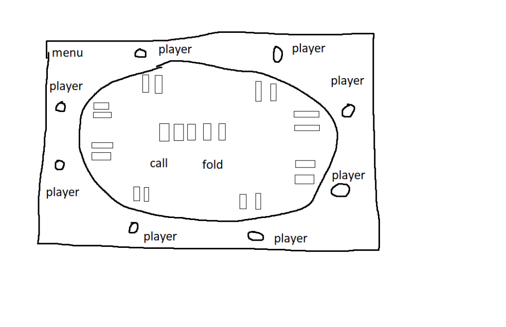

# New Game
The user start the game and gets introduced to a start up menu.
This menu contains one button saying start and a input field where the user can enter intergers.
This integers represent who many poker ai will be playing around the table.

## Game beginngs
Player press start and the a new screen appear with a poker table and 8 seats.
The amount of ai the player enter into the input field will affect how many seats are occupied.
The player now select a seat within a X amount of time.
* **IF** player does not select with in time frame the game will begin without the player.
* **ELSE** The match begins.

### A Match
A match start with the **pre flop round**.
Every player will be presented by their two cards which will from know on be called the player hand.
This player hand will be presented to all players and will be visible to everyone.

Now a pre decided seat by game mechanics will be prompted by two choices.
1. Call
2. Fold
> The option will be on a timer. If time runs out the player will automatically fold.
- **IF** the player fold which means the player stop playing this match and will be inactive for the reset of the match.
- **ELSE** the player calls that means the player keeps playing the match of poker.
After the player have select by this two options the next player will be prompted by the same options.
This will continue player by player having to pick between call or fold.

Once all player have picked. The **Flop round** begins. Now three cards called the community cards will appear in the middle of
the table. Now the first player will have the same prompt as before, Call or Fold.
And the same routine with going one by one player have to select a choice.

The next round is the **Turn round** this round will add one more card the community cards. And same routine for the players. 
The last round is the **River round** this round will add another card to the community cards and the same player routine.

But once all player have made a choice the players that have not folded will now enter into **showdown**.
This is when a winner is declared. Only one player can win and the winner will receive a +1 on their victory counter.
All the cards the players had and who the winner was will be saved on a file.

## New match ?
The winner is declared and the match is over. Will the player play another match?
The choice of a new match will be found by a button asking the player if the want to leave.
* **IF** the player leaves the game is over.
* **ElSE** the player stays and lets the timer run out and a new match begins.
> The option to leave will be available until the player has made a choice in the pre-flop round.

> **NOTE** The game design here will most likely change and mutate by what the game developers considers to be right design features.
> E.i. this design is not set in stone.
